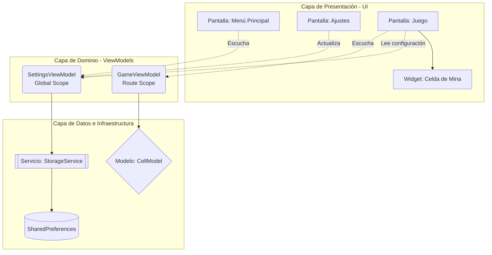
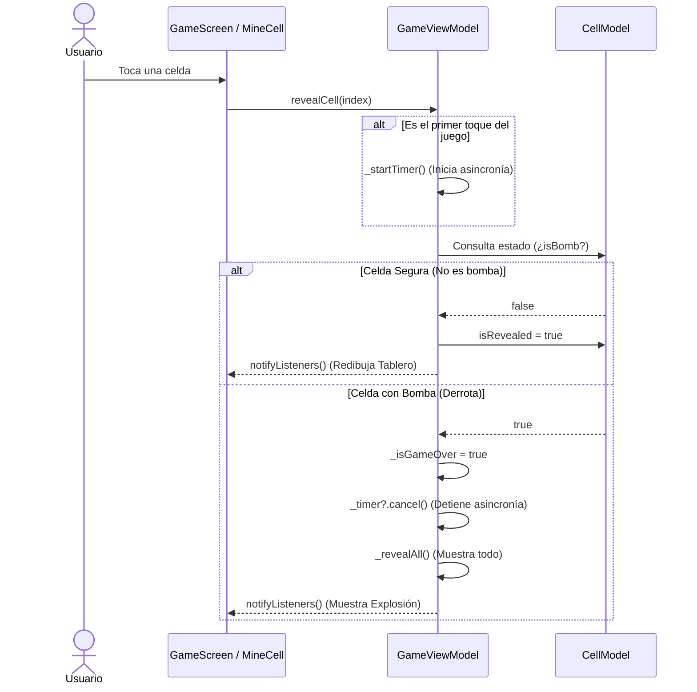
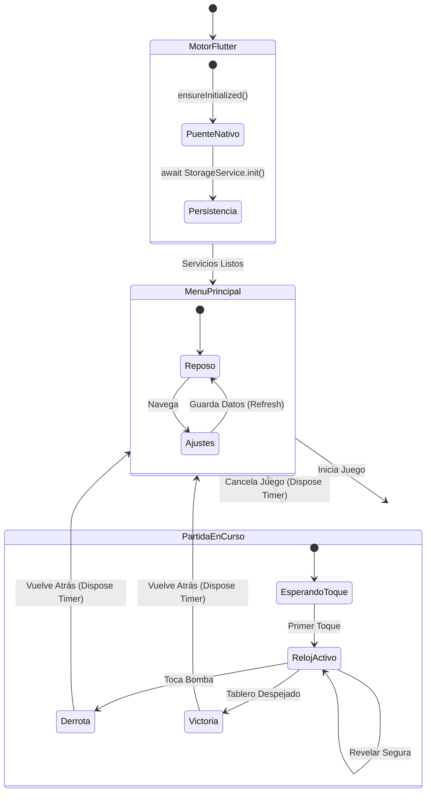

# 💣 Buscaminas - Flutter App

Una versión moderna, reactiva y escalable del clásico juego **Buscaminas**, desarrollada en Flutter. Este proyecto sirve como Prueba de Concepto (PoC) para demostrar patrones avanzados de arquitectura, inyección de dependencias y persistencia de datos en dispositivos móviles.

---

## 🚀 Características Principales (Hasta Lab 6)

* **Arquitectura MVVM:** Separación estricta entre la lógica de negocio (`ViewModels`) y la interfaz gráfica (`Views`).
* **Gestión de Estado Reactiva:** Uso de `MultiProvider` para estado global (Configuraciones) y `ChangeNotifierProvider` para alcance local (Partida).
* **Persistencia Local:** Almacenamiento asíncrono de configuraciones de usuario (Nombre y Dificultad) utilizando `shared_preferences`.
* **Algoritmia Espacial:** Cálculo matemático de matrices (1D a 2D) para la generación dinámica de tableros y conteo de minas adyacentes.
* **Gestión de Memoria:** Implementación de temporizadores (`Timer`) con recolección de basura explícita (`dispose()`) para evitar *Memory Leaks*.
* **Dificultad Dinámica:** Tableros auto-ajustables (8x8, 10x10, 12x12) que responden al motor de renderizado de Flutter.

---
### Resumen de Diagramas Arquitectónicos (DP2)

| Nombre del Diagrama | Uso en el Proyecto (Buscaminas) | Enlace de Referencia |
| :--- | :--- | :--- |
| **Diagrama Estructural (C4 / Capas)** | Evidencia la correcta separación de responsabilidades bajo el patrón MVVM. Demuestra cómo la UI consume la lógica de negocio sin acoplarse, y cómo el dominio se comunica con la capa de datos (`StorageService`). | [Ver detalle estructural](DIAGRAMA_ESTRUCTURAL.md) |
| **Diagrama de Secuencia (UML)** | Modela la interacción asíncrona y el flujo de eventos. Es vital para explicar cómo un toque en la pantalla detona reglas de negocio, activa el `Timer` y notifica a la vista reactiva mediante `Provider`. | [Ver detalle de secuencia](DIAGRAMA_SECUENCIAS.md) |
| **Diagrama de Estados** | Define el ciclo de vida y el comportamiento de la aplicación frente a distintos eventos. Ilustra desde la carga del puente nativo de Flutter, hasta las transiciones críticas de la partida (Jugando, Victoria, Derrota, Reposo). | [Ver detalle de estados](DIAGRAMA_ESTADOS.md) |
---

## 📐 Arquitectura del Sistema (Diagramas DP2)

Como parte de las definiciones de Ingeniería de Software establecidas en la Dinámica Práctica 2, a continuación se modelan las interacciones y la estructura del sistema utilizando el estándar **Mermaid**.

### 1. Diagrama Estructural (Capas y Responsabilidades)
Este diagrama evidencia la separación C4/Clean Architecture. La UI solo observa (`watch`) a los ViewModels, y los ViewModels son los únicos autorizados para interactuar con la infraestructura de Datos.

### 2. Diagrama de secuencias

### 3. Diagrama de estados

